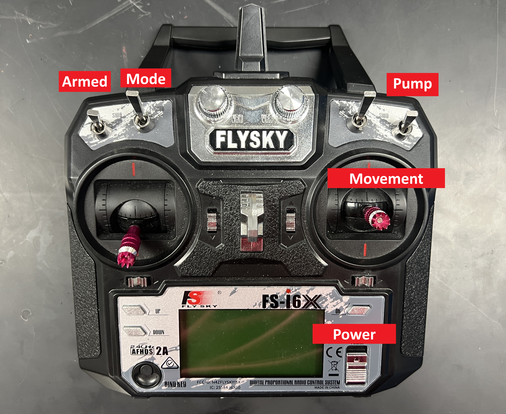
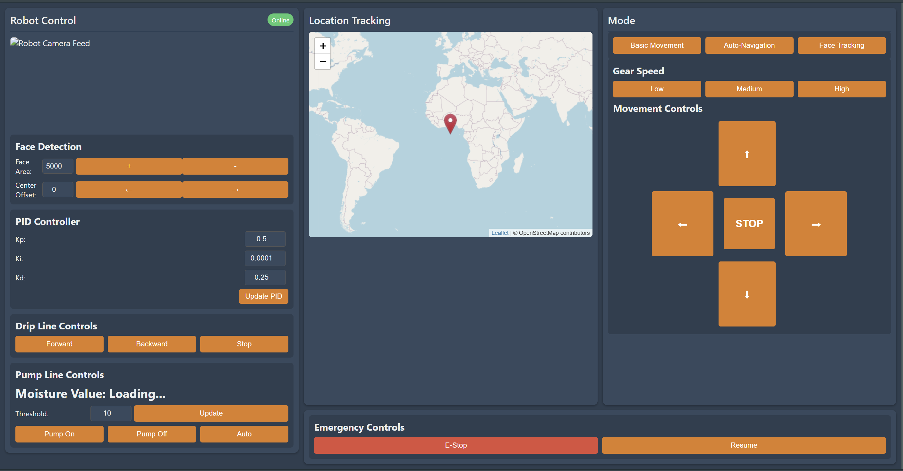

# Autonomous Irrigation Robot
This is an autonomous irrigation robot for precision watering, monitoring, and basic field assistance. This file contains the information to inform both the user and the developers.

## Features
- **Real-time Monitoring:** Live camera feed and sensor data visualization
- **Smart Irrigation:** Moisture-based irrigation control with zone management

### Operation Modes
- **Manual Control:** Web dashboard or remote controller for manual movement and pump control
- **Auto-Navigation:** GPS/IMU-based waypoint navigation with path following
- **Face Tracking:** Computer-vision-based human detection and PID following

---

## Hardware and Software Integration (Developer)

For developer-focused integration details, wiring notes, message formats, and a project file tree see the `DEVELOPER.md` companion file. Below is a concise developer-focused summary to keep in `README` for quick access.

### Hardware Integration — Key Points

- IMU (LSM9DS0 / LSM9DS1 / LSM6DSL + LIS3MDL)
	- Interface: I2C (preferred) or SPI. Verify addresses in `IMU.py` / `LSM*.py`.
	- Test: run the IMU test harness to confirm orientation and sensor health.

- GPS
	- Interface: UART/USB-serial or `gpsd` on Linux. Configure `auto_navigation.py` to the correct device/socket.

- Moisture Sensors
	- Usually published via MQTT topic `moisture/data` from field nodes. Use ADC (ADS1115) for analog sensors.
	- Example payload: `{"zone":"A","value":345,"unit":"raw","timestamp":"2025-12-18T12:00:00Z"}`

- Camera
	- OpenCV-compatible (VideoCapture). For web streaming, use MJPEG/HLS or an ffmpeg pipeline.

- Motors & Drivers
	- Use motor drivers (TB6612, L298N, or similar) and isolate motor power with fuses; map PWM in `central_script.py`.

- Pump & Relay
	- Drive via rated relay/driver and include flyback protection for inductive loads.

- Power & Safety
	- Use common ground, separate high-current wiring, add fuses, and provide an accessible physical E-Stop.

### Software Integration — Key Points

- Development environment
	- Create a Python venv and install `requirements.txt`.
		```bash
		python -m venv .venv
		.venv\Scripts\activate   # Windows
		pip install -r requirements.txt
		```

- Configuration
	- `central_script.py` holds server and MQTT settings. Consider moving to `config.py` or environment variables.

- MQTT topics (examples)
	- `moisture/data` — `{zone, value, timestamp}`
	- `imu/data` — `{ax,ay,az,gx,gy,gz,mag,timestamp}`
	- `robot/status` — `{mode,lat,lon,battery,errors}`
	- `robot/control` — `{cmd: "move", direction: "forward", speed: 0.6}` or `{cmd: "pump", action: "on"}`

- HTTP endpoints (examples in `central_script.py`)
	- `GET /status` — current status
	- `POST /control` — send command JSON
	- `GET /logs` — download CSV logs

- Logging
	- Sensor data is logged to CSV (see `moisture_data.csv`). For production, consider log rotation or SQLite.

### Project File Tree (quick reference)

```
irrigationrobot/
├── central_script.py
├── auto_navigation.py
├── face_tracking.py
├── GUI.py
├── IMU.py
├── LSM*.py
├── README.md
├── DEVELOPER.md
├── requirements.txt
├── moisture_data.csv
├── USER_INTERFACE/
│   ├── GUI.py
│   └── test.html
├── ESP32_ArduinoCode/
│   ├── ESPNOW_sender_PUMP/
│   └── test_irrV5/
└── Images/
		├── controller.jpg
		└── ui_screenshot.jpg
```

---

## Users: Controls & Images





---
